_your zenodo badge here_

# li_et-al_natcom_2023

**The Influence of Climate Change on Flooding and Social Inequalities from Remnants of Hurricane Ida**

Xue Li1\*, Michael F. Wehner2, David R. Judi1 and Robert D. Hetland3

1  Earth Systems Science, Pacific Northwest National Laboratory, Richland, Washington, USA  
2  Applied Mathematics and Computational Research Division, Lawrence Berkeley National Laboratory, Berkeley, California, USA  
3  Atmospheric Science & Global Change, Pacific Northwest National Laboratory, Richland, Washington, USA

\* corresponding author:  xue.li@pnnl.gov

## Abstract
Previous research has demonstrated that tropical cyclone-related precipitation and flooding have been increased by anthropogenic global warming. Our work aims to quantify the contribution of climate change to the deadly flooding from the remnants of Hurricane Ida (2021) and its impact on human society. We developed an analysis framework that combines lessons from climate change attribution science, two-dimensional hydrodynamic modeling, and flood impact evaluation, including a social inequality index, to estimate remnants of Ida flooding and consequences responding to current (locally 1\degree C warmer) and future (another 1\degree C warmer) climate change. We find that an additional quarter to a half million people were exposed to flooding due to current and future climate change. The human influence on flood impacts was larger with deeper flood water depth ($\ge$ 1 m) than with shallow depths. Socially vulnerable populations were found to be disproportionately more affected, and climate change exacerbates this inequality.

## Journal reference
TBD

<!-- ## Code reference
References for each minted software release for all code involved.  

These are generated by Zenodo automatically when conducting a release when Zenodo has been linked to your GitHub repository. The Zenodo references are built by setting the author order in order of contribution to the code using the author's GitHub user name.  This citation can, and likely should, be edited without altering the DOI.

If you have modified a codebase that is outside of a formal release, and the modifications are not planned on being merged back into a version, fork the parent repository and add a `.<shortname>` to the version number of the parent and construct your own name.  For example, `v1.2.5.hydro`.

Human, I.M. (2021, April 14). Project/repo:v0.1.0 (Version v0.1.0). Zenodo. http://doi.org/some-doi-number/zenodo.7777777 -->

## Data reference
Both input and output data are available in the following reference:

Li, X. et al. (2023). Data from "The Influence of Climate Change on Flooding and Social Inequalities from Remnants of Hurricane Ida" [Data set]. MSD-LIVE Data Repository. https://doi.org/10.57931/2000435  

Data are organized in subfolders by topic.

### Input data
|Dataset|Path|
|---------|-----------------|
|[Hourly Stage IV QPE](https://doi.org/10.5065/D6PG1QDD)|prcp/original/*.tif|
|[NLCD 2019](https://www.mrlc.gov/data/nlcd-2019-land-cover-conus)|impact/landcover/nlcd/nlcd_2019_land_cover_l48_20210604.zip|
|[NLCD 2019 Developed Imperviousness Descriptor](https://www.mrlc.gov/data/nlcd-2019-land-cover-conus)|impact/landcover/nlcd/nlcd_2019_impervious_descriptor_l48_20210604.zip|
|[LandScan USA 2020 - CONUS Night](https://doi.org/10.48690/1523373)|impact/population/landscan/conus_night.tif|
|[CDC/ATSDR Social Vulnerability Index 2020](https://www.atsdr.cdc.gov/placeandhealth/svi/data_documentation_download.html)|impact/population/svi/SVI_US2020.zip|
|HUC4 domains exported from [NHDPlus HR WBD](https://www.usgs.gov/national-hydrography/nhdplus-high-resolution)|support/domain.shp|
|HUC12 polygons exported from [NHDPlus HR WBD](https://www.usgs.gov/national-hydrography/nhdplus-high-resolution)|support/huc12.shp|
|Water masks derived from [NHDPlus HR](https://www.usgs.gov/national-hydrography/nhdplus-high-resolution)|flood/water_mask/*.tif|
|[High-Water Mark](https://stn.wim.usgs.gov/STNDataPortal/)|flood/validation/hwm_312.csv|

Additional political boundary datasets were aquired from [Census TIGER/Line Shapefiles](https://www.census.gov/geographies/mapping-files/time-series/geo/tiger-line-file.2020.html#list-tab-790442341) and [HIFLD](https://hifld-geoplatform.opendata.arcgis.com/datasets/geoplatform::political-boundaries-area/explore) to draw basemaps in figures and can be found in the support folder.

### Output data
Include intermediate and final output data:
|Dataset|Path|
|---------|-----------------|
|Total precipitation in present scenario|prcp/present_prcp_total.tif|
|Peak flood depth for each domain and scenario|flood/RIFT_results/*h.tif|
|Peak rate of rise for each domain and scenario|flood/RIFT_results/*dhdt.tif|
|Peak total head for each domain and scenario|flood/RIFT_results/*he.tif|
|Flood characteristic summary (HUC4 and HUC12)|flood/huc*/flood.csv|
|Climate change contribution to flood characteristics (HUC4 and HUC12)|flood/huc*/diff.csv|
|Validation results by domain|flood/validation/hwm_rift.csv|
|Flood exposure by domain, scenario, depth threshold, and landcover type|impact/nlcd/summary.csv|
|Downscale population by domain|impact/population/downscaled/*.tif|
|Population exposure by domain, scenario, and depth threshold|impact/population/summary.csv|
|Gridded overall SVI by domain|impact/population/svi/*.tif|
|SVI summary for background population by domain|impact/population/svi_bg.csv|
|SVI summary for exposed population by domain, scenario, and depth threshold|impact/population/svi.csv|

<!-- ## Contributing modeling software
| Model | Version | Repository Link | DOI |
|-------|---------|-----------------|-----|
| model 1 | version | link to code repository | link to DOI dataset |
| model 2 | version | link to code repository | link to DOI dataset |
| component 1 | version | link to code repository | link to DOI dataset | -->

## Reproduce my experiement
Follow the steps below to reproduce my work:

1. Download data from [Data Reference](#input-data) and copy to the data subfolder. All workflow scripts expect data in reletive locations.
2. The RIFT model is in the process of becoming open source. So the RIFT output files are provided as inputs in subsequent data processing and analysis.
2. Run the following scripts in the `workflow` directory to re-create this experiment:

| Script Name | Description | 
| --- | --- | 
| `prcp.py` | Aggregate hourly precipitation data to total precipitation for plotting | 
| `flood_huc4.py` | Sumarise flood characteristics and cliamte-related changes at HUC4 level | 
| `flood_huc12.py` | Sumarise flood characteristics and cliamte-related changes at HUC12 level | 
| `popDownscale.py` | Downscale LandScan population grids from 3 to 1 arc-sec| 
| `exposure.py` | Summarise land and population exposure | 
| `sviRasterize.py` | Rasterize SVI to match downscaled population grids | 

## Reproduce my figures and tables
Use the scripts found in the `figures` directory to reproduce the figures and tables used in this publication.

| Script Name | Description | 
| --- | --- | 
| `plot_table.R` | Script to generate my figures and tables   Preferably run in IDE (e.g., RStudio) |

### Major figures
Precipitation and flood simulation results for the present scenario. Total precipitation (a) and simulated flood characteristics averaged at HUC12 level, including (b) peak flood water depth, (c) peak rate-of-rise, (d) peak total head, and (e) percent of land area flooded.
|  |  |  |
| --- | --- | --- | 
|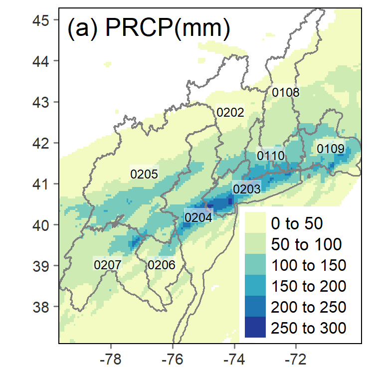  |  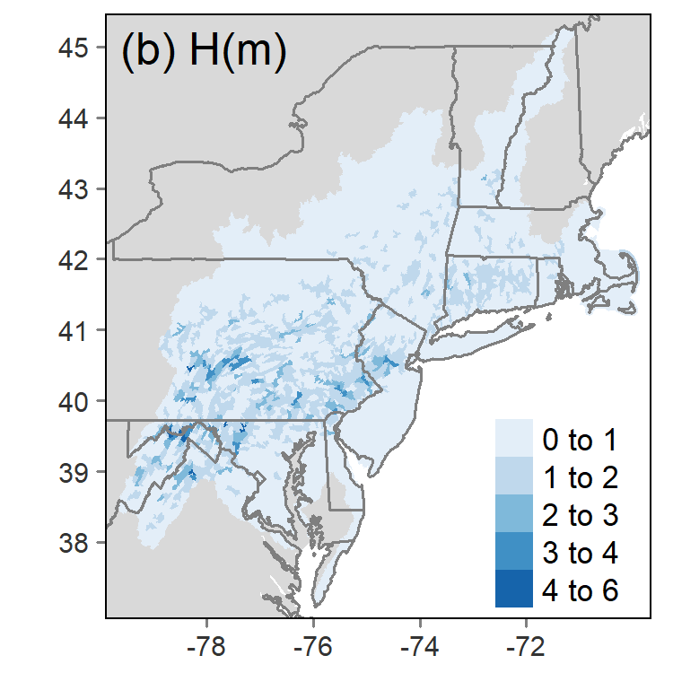| 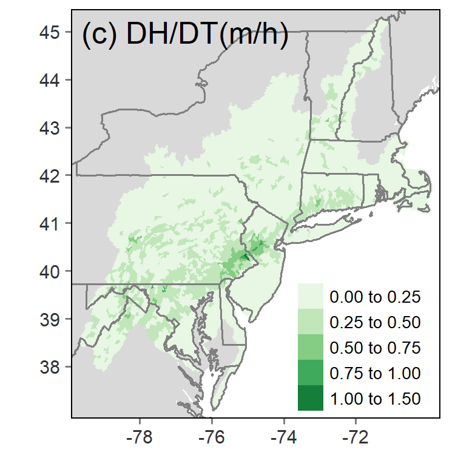|
|  | 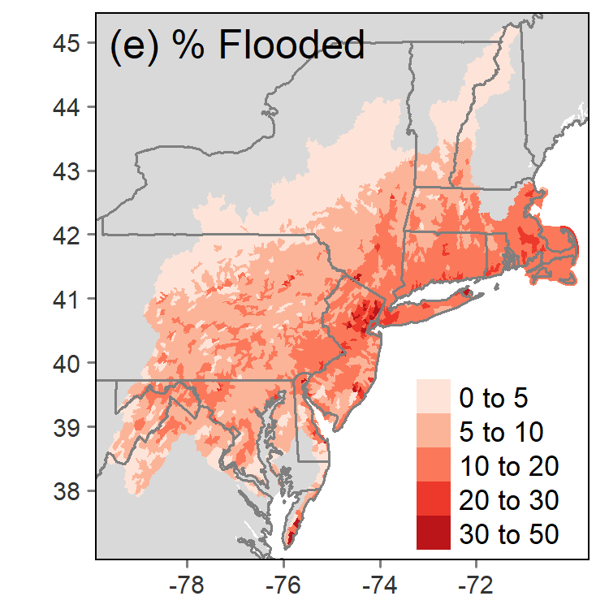||

Climate change contributions to flood characteristics for the past 14% scenario at HU12-level. The left panel shows the spatial pattern of differences due to reduced precipitation, and the right panel shows the correlation of differences to the intensity of present-day value.

|
 
|
 
|
 
|
| --- | --- |--- |
||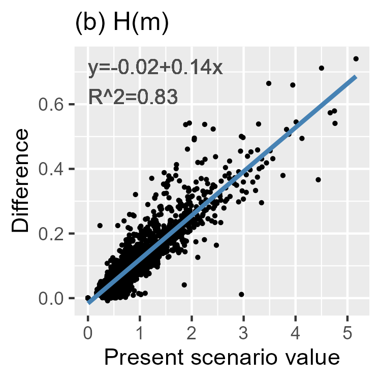||
|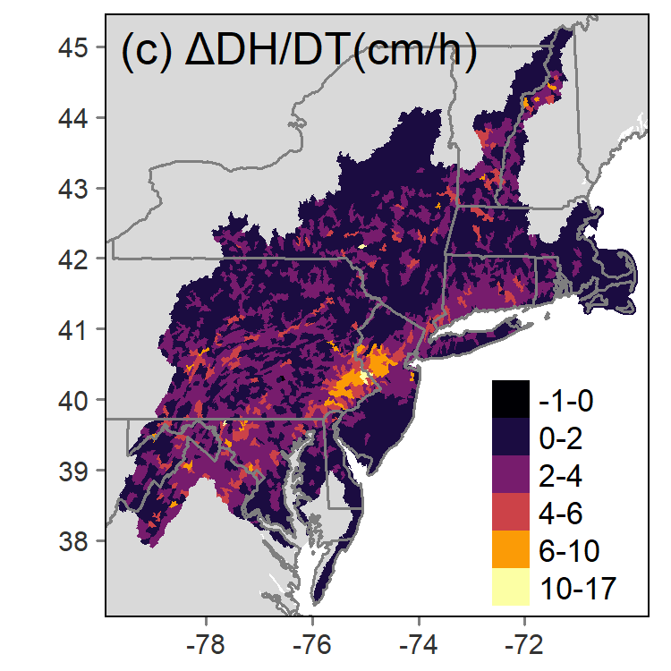|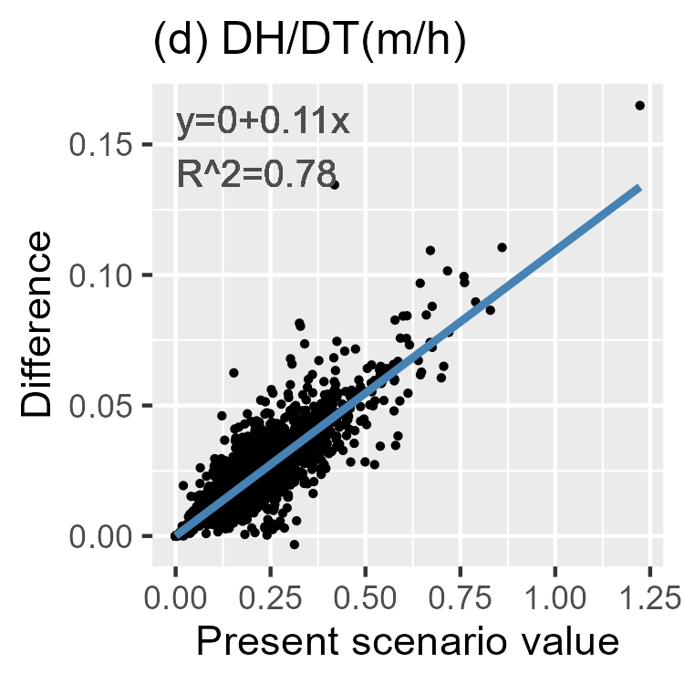||
|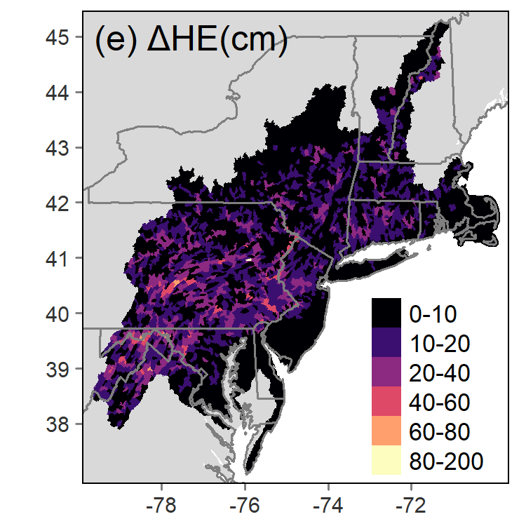|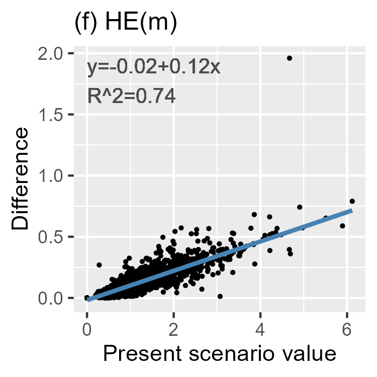||
|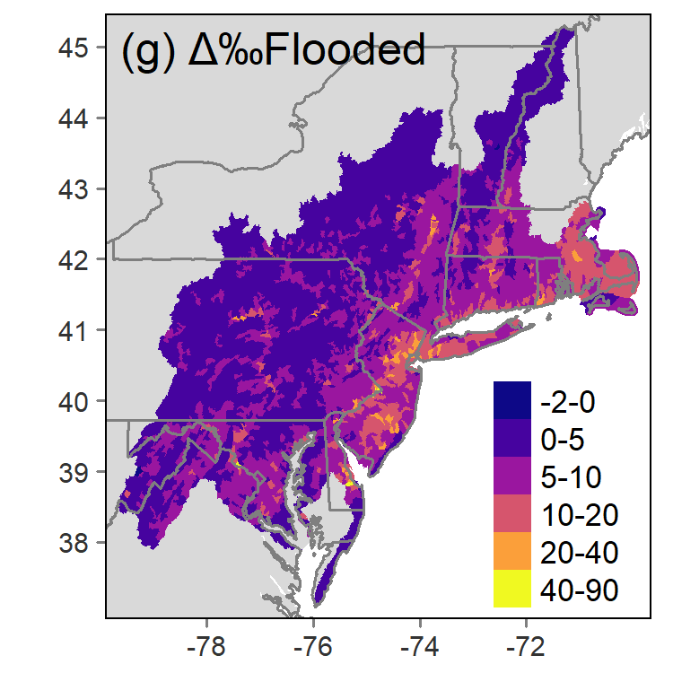|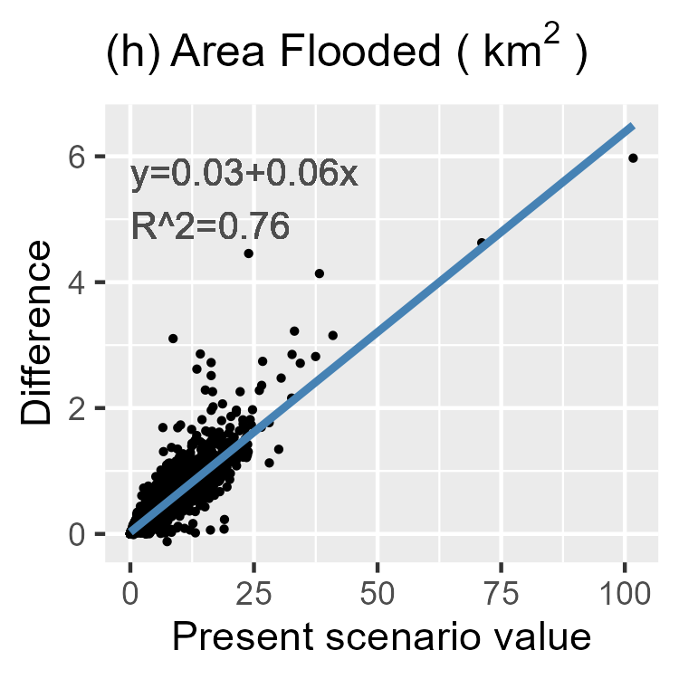||

Flood impacts and climate change contribution at different impact levels. Flood impacts were presented from (a) area of developed land and (b) population exposed to floodwater exceeding specific depth thresholds. One ft is approximately 0.3 m.  
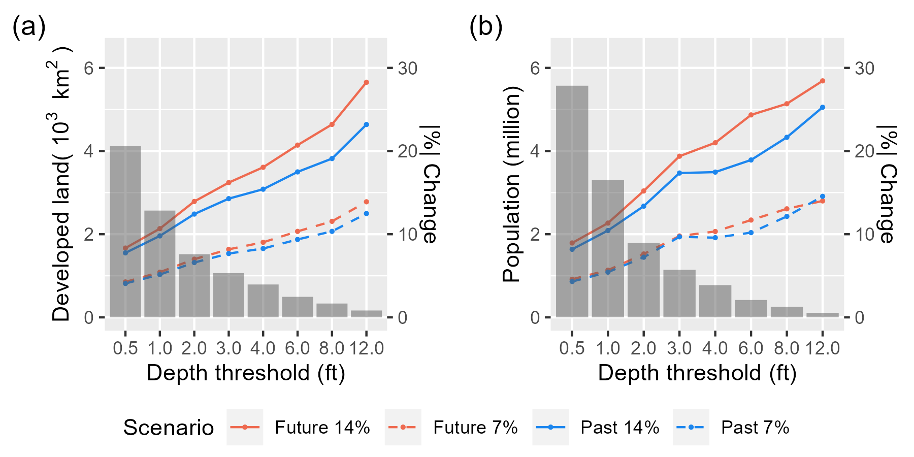

Social inequality of flood exposure and the role of climate change. Data were summarised for people exposed to deeper than 0.5 ft (≈ 0.15m, a) and 3 ft (≈ 1m, b) of floodwater. Inequality was presented through concentration curves of population against vulnerability (left) and tables specifying concentration and SII values in different cases (right). Dash lines indicate theoretical uniform exposure.
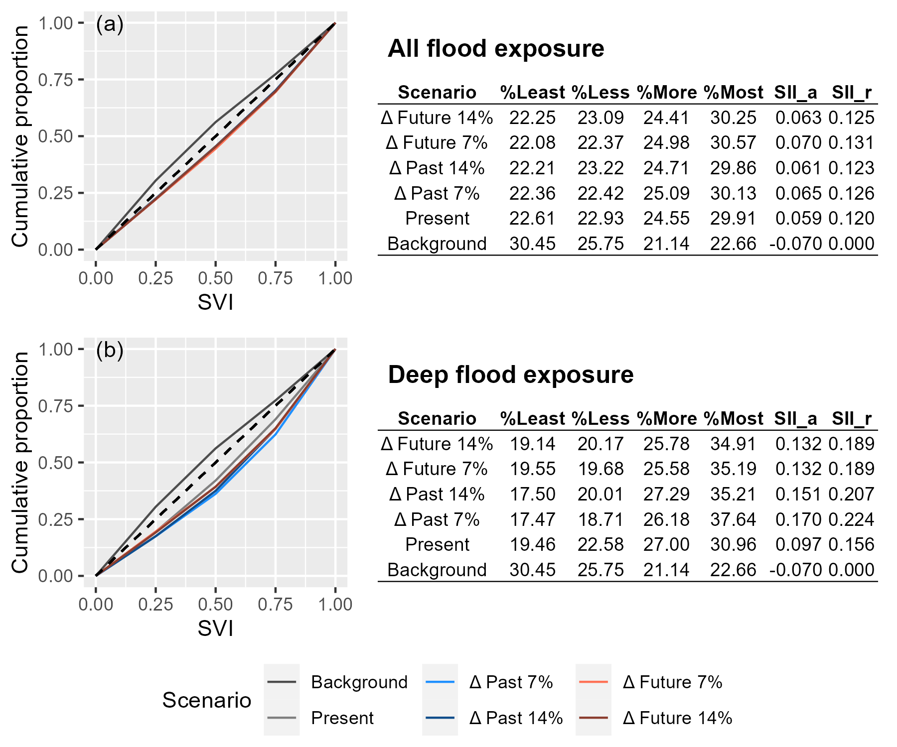
